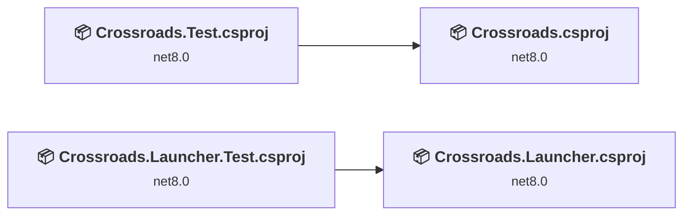
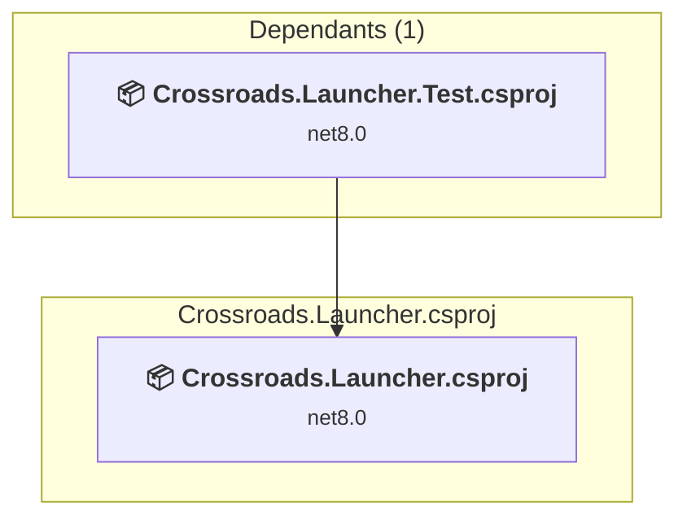
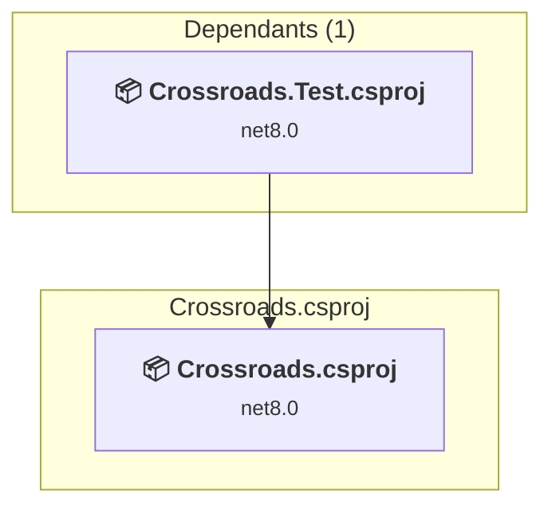
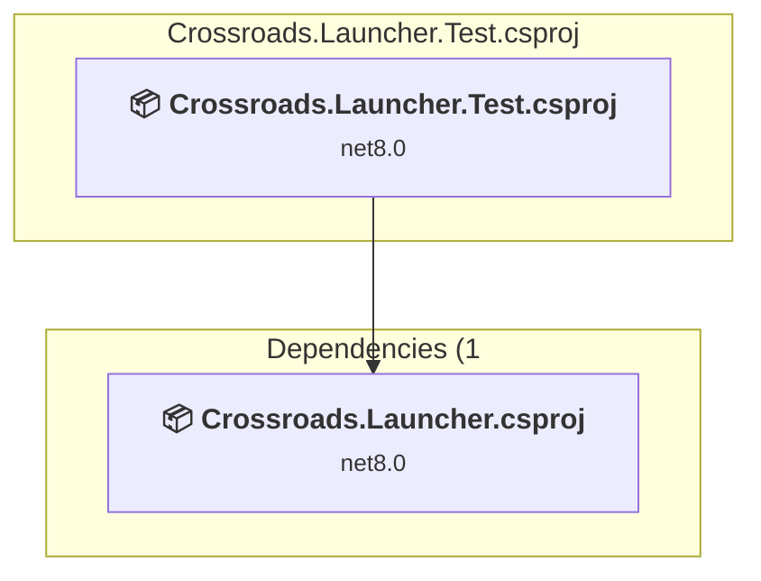
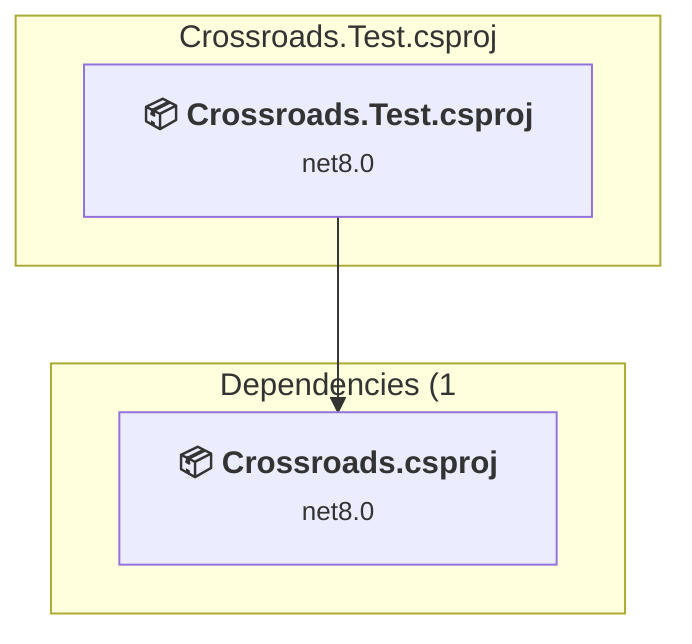

# Projects and dependencies analysis

This document provides a comprehensive overview of the projects and their dependencies in the context of upgrading to .NETCoreApp,Version=v10.0.

## Table of Contents

- [Executive Summary](#executive-Summary)
  - [Highlevel Metrics](#highlevel-metrics)
  - [Projects Compatibility](#projects-compatibility)
  - [Package Compatibility](#package-compatibility)
  - [API Compatibility](#api-compatibility)
- [Aggregate NuGet packages details](#aggregate-nuget-packages-details)
- [Top API Migration Challenges](#top-api-migration-challenges)
  - [Technologies and Features](#technologies-and-features)
  - [Most Frequent API Issues](#most-frequent-api-issues)
- [Projects Relationship Graph](#projects-relationship-graph)
- [Project Details](#project-details)

  - [src\Crossroads.Launcher\Crossroads.Launcher.csproj](#srccrossroadslaunchercrossroadslaunchercsproj)
  - [src\Crossroads\Crossroads.csproj](#srccrossroadscrossroadscsproj)
  - [test\Crossroads.Launcher.Test\Crossroads.Launcher.Test.csproj](#testcrossroadslaunchertestcrossroadslaunchertestcsproj)
  - [test\Crossroads.Test\Crossroads.Test.csproj](#testcrossroadstestcrossroadstestcsproj)

## Executive Summary

### Highlevel Metrics

| Metric | Count | Status |
| :--- | :---: | :--- |
| Total Projects | 4 | All require upgrade |
| Total NuGet Packages | 16 | 4 need upgrade |
| Total Code Files | 65 |  |
| Total Code Files with Incidents | 16 |  |
| Total Lines of Code | 6099 |  |
| Total Number of Issues | 185 |  |
| Estimated LOC to modify | 174+ | at least 2.9% of codebase |

### Projects Compatibility

| Project | Target Framework | Difficulty | Package Issues | API Issues | Est. LOC Impact | Description |
| :--- | :---: | :---: | :---: | :---: | :---: | :--- |
| [src\Crossroads.Launcher\Crossroads.Launcher.csproj](#srccrossroadslaunchercrossroadslaunchercsproj) | net8.0 | 🟢 Low | 2 | 44 | 44+ | DotNetCoreApp, Sdk Style = True |
| [src\Crossroads\Crossroads.csproj](#srccrossroadscrossroadscsproj) | net8.0 | 🟢 Low | 3 | 79 | 79+ | DotNetCoreApp, Sdk Style = True |
| [test\Crossroads.Launcher.Test\Crossroads.Launcher.Test.csproj](#testcrossroadslaunchertestcrossroadslaunchertestcsproj) | net8.0 | 🟢 Low | 1 | 26 | 26+ | DotNetCoreApp, Sdk Style = True |
| [test\Crossroads.Test\Crossroads.Test.csproj](#testcrossroadstestcrossroadstestcsproj) | net8.0 | 🟢 Low | 1 | 25 | 25+ | DotNetCoreApp, Sdk Style = True |

### Package Compatibility

| Status | Count | Percentage |
| :--- | :---: | :---: |
| ✅ Compatible | 12 | 75.0% |
| ⚠️ Incompatible | 1 | 6.3% |
| 🔄 Upgrade Recommended | 3 | 18.8% |
| ***Total NuGet Packages*** | ***16*** | ***100%*** |

### API Compatibility

| Category | Count | Impact |
| :--- | :---: | :--- |
| 🔴 Binary Incompatible | 7 | High - Require code changes |
| 🟡 Source Incompatible | 167 | Medium - Needs re-compilation and potential conflicting API error fixing |
| 🔵 Behavioral change | 0 | Low - Behavioral changes that may require testing at runtime |
| ✅ Compatible | 4999 |  |
| ***Total APIs Analyzed*** | ***5173*** |  |

## Aggregate NuGet packages details

| Package | Current Version | Suggested Version | Projects | Description |
| :--- | :---: | :---: | :--- | :--- |
| coverlet.collector | 6.0.4 |  | [Crossroads.Launcher.Test.csproj](#testcrossroadslaunchertestcrossroadslaunchertestcsproj) [Crossroads.Test.csproj](#testcrossroadstestcrossroadstestcsproj) | ✅Compatible |
| coverlet.msbuild | 6.0.4 |  | [Crossroads.Launcher.Test.csproj](#testcrossroadslaunchertestcrossroadslaunchertestcsproj) [Crossroads.Test.csproj](#testcrossroadstestcrossroadstestcsproj) | ✅Compatible |
| GitVersion.MsBuild | 6.6.0 |  | [Crossroads.csproj](#srccrossroadscrossroadscsproj) | ✅Compatible |
| Microsoft.CodeAnalysis.Analyzers | 4.14.0 |  | [Crossroads.csproj](#srccrossroadscrossroadscsproj) | ✅Compatible |
| Microsoft.CodeAnalysis.CSharp | 5.0.0 |  | [Crossroads.csproj](#srccrossroadscrossroadscsproj) | ✅Compatible |
| Microsoft.Extensions.Configuration | 9.0.10 | 10.0.4 | [Crossroads.csproj](#srccrossroadscrossroadscsproj) [Crossroads.Launcher.csproj](#srccrossroadslaunchercrossroadslaunchercsproj) | NuGet package upgrade is recommended |
| Microsoft.Extensions.DependencyModel | 9.0.10 | 10.0.4 | [Crossroads.csproj](#srccrossroadscrossroadscsproj) | NuGet package upgrade is recommended |
| Microsoft.Extensions.Hosting | 9.0.10 | 10.0.4 | [Crossroads.csproj](#srccrossroadscrossroadscsproj) [Crossroads.Launcher.csproj](#srccrossroadslaunchercrossroadslaunchercsproj) | NuGet package upgrade is recommended |
| Microsoft.NET.Test.Sdk | 18.0.1 |  | [Crossroads.Launcher.Test.csproj](#testcrossroadslaunchertestcrossroadslaunchertestcsproj) [Crossroads.Test.csproj](#testcrossroadstestcrossroadstestcsproj) | ✅Compatible |
| Moq | 4.20.72 |  | [Crossroads.Launcher.Test.csproj](#testcrossroadslaunchertestcrossroadslaunchertestcsproj) [Crossroads.Test.csproj](#testcrossroadstestcrossroadstestcsproj) | ✅Compatible |
| Newtonsoft.Json | 13.0.4 |  | [Crossroads.csproj](#srccrossroadscrossroadscsproj) | ✅Compatible |
| System.CommandLine.Hosting | 0.3.0-alpha.21216.1 |  | [Crossroads.csproj](#srccrossroadscrossroadscsproj) [Crossroads.Launcher.csproj](#srccrossroadslaunchercrossroadslaunchercsproj) | ✅Compatible |
| TestableIO.System.IO.Abstractions.TestingHelpers | 22.1.0 |  | [Crossroads.Launcher.Test.csproj](#testcrossroadslaunchertestcrossroadslaunchertestcsproj) [Crossroads.Test.csproj](#testcrossroadstestcrossroadstestcsproj) | ✅Compatible |
| TestableIO.System.IO.Abstractions.Wrappers | 22.1.0 |  | [Crossroads.csproj](#srccrossroadscrossroadscsproj) [Crossroads.Launcher.csproj](#srccrossroadslaunchercrossroadslaunchercsproj) | ✅Compatible |
| xunit | 2.9.3 |  | [Crossroads.Launcher.Test.csproj](#testcrossroadslaunchertestcrossroadslaunchertestcsproj) [Crossroads.Test.csproj](#testcrossroadstestcrossroadstestcsproj) | ⚠️NuGet package is deprecated |
| xunit.runner.visualstudio | 3.1.5 |  | [Crossroads.Launcher.Test.csproj](#testcrossroadslaunchertestcrossroadslaunchertestcsproj) [Crossroads.Test.csproj](#testcrossroadstestcrossroadstestcsproj) | ✅Compatible |

## Top API Migration Challenges

### Technologies and Features

| Technology | Issues | Percentage | Migration Path |
| :--- | :---: | :---: | :--- |

### Most Frequent API Issues

| API | Count | Percentage | Category |
| :--- | :---: | :---: | :--- |
| T:System.CommandLine.Option | 30 | 17.2% | Source Incompatible |
| M:System.CommandLine.Command.AddOption(System.CommandLine.Option) | 20 | 11.5% | Source Incompatible |
| T:System.CommandLine.Builder.CommandLineBuilder | 17 | 9.8% | Source Incompatible |
| T:System.CommandLine.Invocation.ICommandHandler | 16 | 9.2% | Source Incompatible |
| P:System.CommandLine.Command.Handler | 8 | 4.6% | Source Incompatible |
| M:Microsoft.Extensions.Configuration.ConfigurationBinder.Get''1(Microsoft.Extensions.Configuration.IConfiguration) | 7 | 4.0% | Binary Incompatible |
| M:System.CommandLine.Command.#ctor(System.String,System.String) | 6 | 3.4% | Source Incompatible |
| T:System.CommandLine.Command | 6 | 3.4% | Source Incompatible |
| T:System.CommandLine.Parsing.ParserExtensions | 6 | 3.4% | Source Incompatible |
| M:System.CommandLine.Builder.CommandLineBuilder.#ctor(System.CommandLine.Command) | 6 | 3.4% | Source Incompatible |
| T:System.CommandLine.Hosting.HostingExtensions | 6 | 3.4% | Source Incompatible |
| M:System.CommandLine.Hosting.HostingExtensions.UseHost(System.CommandLine.Builder.CommandLineBuilder,System.Func{System.String[],Microsoft.Extensions.Hosting.IHostBuilder},System.Action{Microsoft.Extensions.Hosting.IHostBuilder}) | 6 | 3.4% | Source Incompatible |
| T:System.CommandLine.Parsing.Parser | 6 | 3.4% | Source Incompatible |
| M:System.CommandLine.Builder.CommandLineBuilder.Build | 6 | 3.4% | Source Incompatible |
| T:System.CommandLine.Builder.CommandLineBuilderExtensions | 5 | 2.9% | Source Incompatible |
| T:System.CommandLine.Parsing.ParseResultExtensions | 4 | 2.3% | Source Incompatible |
| M:System.CommandLine.Parsing.ParseResultExtensions.InvokeAsync(System.CommandLine.Parsing.ParseResult,System.CommandLine.IConsole) | 4 | 2.3% | Source Incompatible |
| T:System.CommandLine.Parsing.ParseResult | 4 | 2.3% | Source Incompatible |
| M:System.CommandLine.Parsing.ParserExtensions.Parse(System.CommandLine.Parsing.Parser,System.String) | 4 | 2.3% | Source Incompatible |
| M:System.CommandLine.Parsing.ParserExtensions.InvokeAsync(System.CommandLine.Parsing.Parser,System.String[],System.CommandLine.IConsole) | 2 | 1.1% | Source Incompatible |
| M:System.CommandLine.Builder.CommandLineBuilderExtensions.UseDefaults(System.CommandLine.Builder.CommandLineBuilder) | 2 | 1.1% | Source Incompatible |
| M:System.CommandLine.RootCommand.#ctor(System.String) | 2 | 1.1% | Source Incompatible |
| T:System.CommandLine.RootCommand | 1 | 0.6% | Source Incompatible |

## Projects Relationship Graph

Legend:
📦 SDK-style project
⚙️ Classic project

## Project Details

### src\Crossroads.Launcher\Crossroads.Launcher.csproj

#### Project Info

- **Current Target Framework:** net8.0
- **Proposed Target Framework:** net10.0
- **SDK-style**: True
- **Project Kind:** DotNetCoreApp
- **Dependencies**: 0
- **Dependants**: 1
- **Number of Files**: 10
- **Number of Files with Incidents**: 6
- **Lines of Code**: 491
- **Estimated LOC to modify**: 44+ (at least 9.0% of the project)

#### Dependency Graph

Legend:
📦 SDK-style project
⚙️ Classic project

### API Compatibility

| Category | Count | Impact |
| :--- | :---: | :--- |
| 🔴 Binary Incompatible | 7 | High - Require code changes |
| 🟡 Source Incompatible | 37 | Medium - Needs re-compilation and potential conflicting API error fixing |
| 🔵 Behavioral change | 0 | Low - Behavioral changes that may require testing at runtime |
| ✅ Compatible | 389 |  |
| ***Total APIs Analyzed*** | ***433*** |  |

### src\Crossroads\Crossroads.csproj

#### Project Info

- **Current Target Framework:** net8.0
- **Proposed Target Framework:** net10.0
- **SDK-style**: True
- **Project Kind:** DotNetCoreApp
- **Dependencies**: 0
- **Dependants**: 1
- **Number of Files**: 38
- **Number of Files with Incidents**: 4
- **Lines of Code**: 3840
- **Estimated LOC to modify**: 79+ (at least 2.1% of the project)

#### Dependency Graph

Legend:
📦 SDK-style project
⚙️ Classic project

### API Compatibility

| Category | Count | Impact |
| :--- | :---: | :--- |
| 🔴 Binary Incompatible | 0 | High - Require code changes |
| 🟡 Source Incompatible | 79 | Medium - Needs re-compilation and potential conflicting API error fixing |
| 🔵 Behavioral change | 0 | Low - Behavioral changes that may require testing at runtime |
| ✅ Compatible | 2389 |  |
| ***Total APIs Analyzed*** | ***2468*** |  |

### test\Crossroads.Launcher.Test\Crossroads.Launcher.Test.csproj

#### Project Info

- **Current Target Framework:** net8.0
- **Proposed Target Framework:** net10.0
- **SDK-style**: True
- **Project Kind:** DotNetCoreApp
- **Dependencies**: 1
- **Dependants**: 0
- **Number of Files**: 7
- **Number of Files with Incidents**: 3
- **Lines of Code**: 558
- **Estimated LOC to modify**: 26+ (at least 4.7% of the project)

#### Dependency Graph

Legend:
📦 SDK-style project
⚙️ Classic project

### API Compatibility

| Category | Count | Impact |
| :--- | :---: | :--- |
| 🔴 Binary Incompatible | 0 | High - Require code changes |
| 🟡 Source Incompatible | 26 | Medium - Needs re-compilation and potential conflicting API error fixing |
| 🔵 Behavioral change | 0 | Low - Behavioral changes that may require testing at runtime |
| ✅ Compatible | 1079 |  |
| ***Total APIs Analyzed*** | ***1105*** |  |

### test\Crossroads.Test\Crossroads.Test.csproj

#### Project Info

- **Current Target Framework:** net8.0
- **Proposed Target Framework:** net10.0
- **SDK-style**: True
- **Project Kind:** DotNetCoreApp
- **Dependencies**: 1
- **Dependants**: 0
- **Number of Files**: 14
- **Number of Files with Incidents**: 3
- **Lines of Code**: 1210
- **Estimated LOC to modify**: 25+ (at least 2.1% of the project)

#### Dependency Graph

Legend:
📦 SDK-style project
⚙️ Classic project

### API Compatibility

| Category | Count | Impact |
| :--- | :---: | :--- |
| 🔴 Binary Incompatible | 0 | High - Require code changes |
| 🟡 Source Incompatible | 25 | Medium - Needs re-compilation and potential conflicting API error fixing |
| 🔵 Behavioral change | 0 | Low - Behavioral changes that may require testing at runtime |
| ✅ Compatible | 1142 |  |
| ***Total APIs Analyzed*** | ***1167*** |  |

