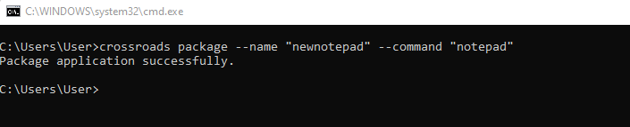
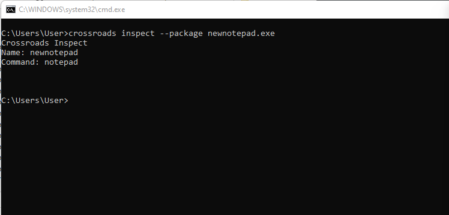
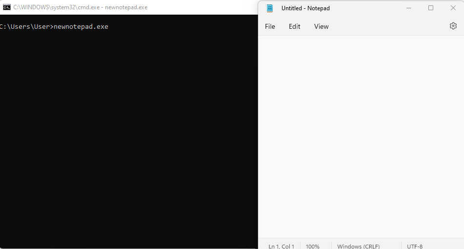
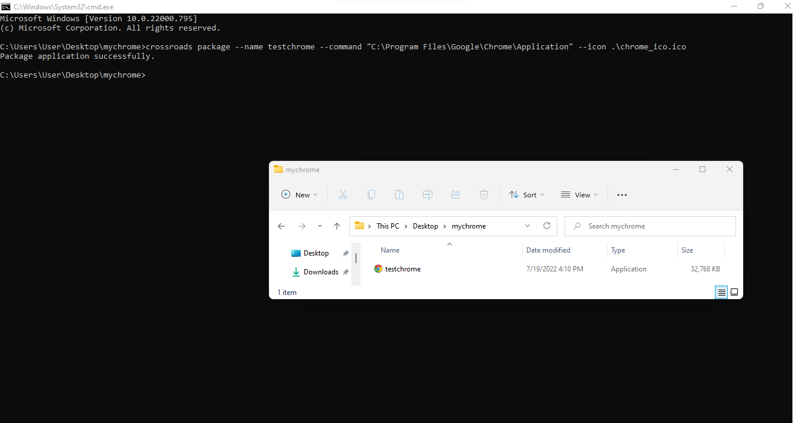
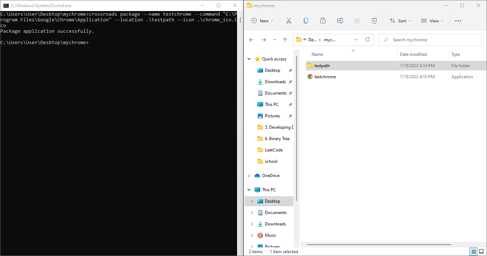
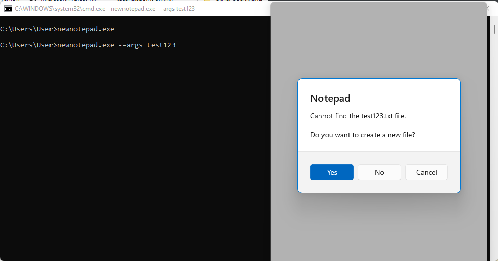
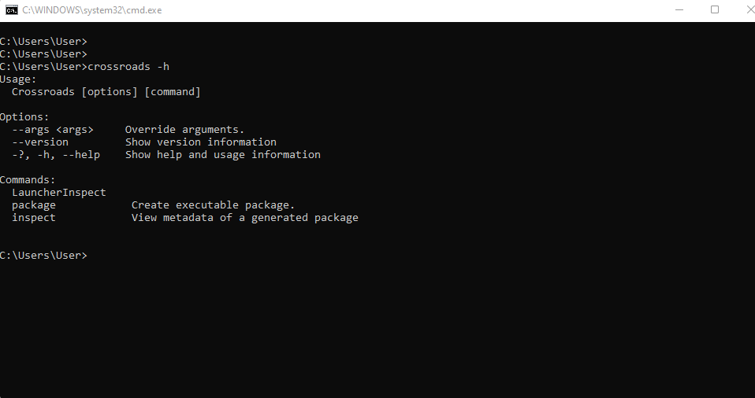

# This is the official user guide for the Crossroads (Packaging tool)
# Why a user will use crossroads.

Crossroads is a dotnet core commandline tool packager used specifically in cases where huge applications are to be shipped for deployment purposes. Instead of having different componentes shipped differently, our crossroads packages all theses into one executable file to be distributed.

# In this documentation the visual studio code application is used for demo purposes.

# Basic usage

## Consolidate all additional files in the application into one executable file:

In the deployment of a huge application where several dependencies are stored in different files,distribition of these files become difficult. some teams would like to consolidate their solution into one executable  file hence the crossroads comes becomes useful:

## Package Application.

```powershell
crossroads package --name <packagename> --command ""
```
The output indicates successful packaging of the application.



## Inspect metadata of packaged application
Assuming a user wants to investigate which metadata their package has: 

```powershell
crossroads inspect --package <appname>.exe
```


## Launch packaged application

```powershell
<appname>.exe 
```


## Customise your package with a name, icon, version and other attributes
### Customize with icon only:
Asssuming a user would want to customize an application with an icon only inorder to uniquely identify launched applications:

```powershell
 crossroads package --name <package_name> --command "<path_to_executable_application>" --icon <icon_name>
```


### Specify a custom location for your package:

Assuming a user would want to specify a custom location to store the package use:

 ```powershell
 crossroads package --name <package_name> --command "<path_to_executable_application>" --loaction <location_name>
```


### Launch an application with arguments:
Assuming a user would want to package and launch an application say  "chrome" and the chrome should open "google.com" when launched:

```powershell
 crossroads package --name <package_name> --command "<path_to_executable_application>" --location <location_name>
```


### To show help options:

```powershell
 crossroads -h
```
The output is shown below:




