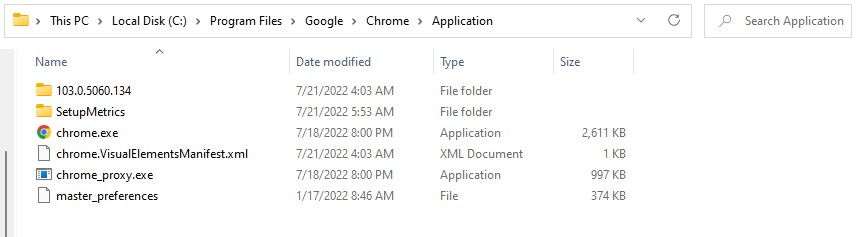
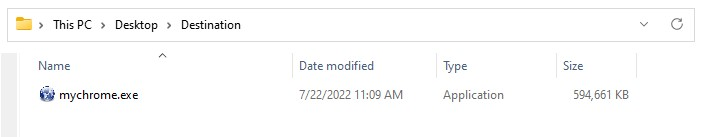
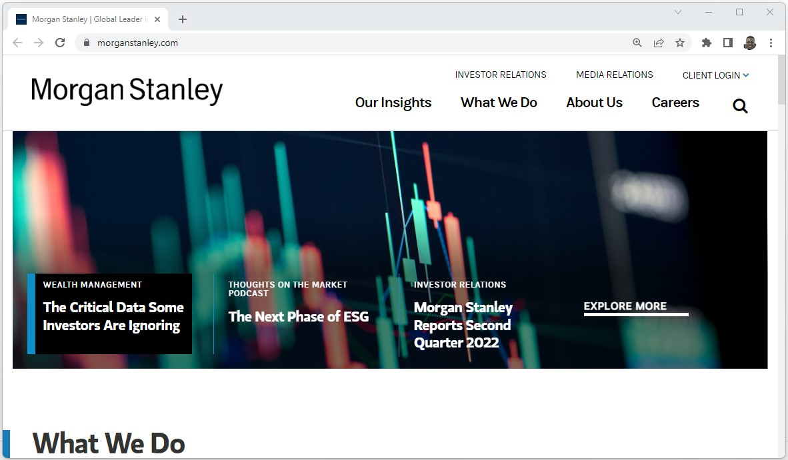

## Test Case - Customizing an Existing Application

Assuming we have an existing executable application. Using Crossroads you can customize an existing app for unique identification. This makes it easier to be distributed to other users. When then end users launches the packaged application they will have the same features and properties of the appliatication. 

In this scenario, we will use the `Chrome` application to demonstrate how any generic executable application can be customized.

### Installation and Usage
To install crossroads as a global dotnet tool, run this command:
```
dotnet tool install -g MorganStanley.Crossroads
```

To view the list of available commands:
```
crossroads --help
```

Result:
```
Usage:
  Crossroads [options] [command]

Options:
  --args <args>     Override arguments.
  --version         Show version information
  -?, -h, --help    Show help and usage information

Commands:
  LauncherInspect
  package            Create executable package.
  inspect            View metadata of a generated package
```

### Existing executable application
Usually, an existing application like `Chrome` has its resources on drive looking like this:

   

To generate a custom chrome with the <code>crossroads</code> tool, run the command;
```
crossroads package --name mychrome --command "chrome.exe" --args "https://www.morganstanley.com/" --location "C:\Users\User\Desktop\Destination" --icon "C:\Users\User\Desktop\myicon.ico" --version 1.0 --include "C:\Program Files\Google\Chrome\Application"
```

- `--name`: the final name for the packaged application
- `--command`: reference to the executable application
- `--args`: the arguments passed to the executable application
- `--locaiton`: destination for the packaged application to reside  
- `--icon`: an icon for the custom application in `.ico`-format
- `--version`: the version for the custom application. The version can be bumped when package is updated.
- `--include`: resources that can be bundled together. This can either be dependencies or additional attachement files.

Result:

   

The custom chrome is generated as self-contained single file. This can be shared and distributed.

### Package inspection
To inspect the packaged application in order to show its metadata, run:
```
crossroads inspect --package "mychrome.exe"
```

Result:
```
Name: mychrome
Command: C:\Program Files\Google\Chrome\Application\chrome.exe
Args: https://www.morganstanley.com/
Version: 1.0
Icon: C:\Users\User\Desktop\myicon.ico
Location: C:\Users\User\Desktop\Destination
Include:
  C:\Program Files\Google\Chrome\Application

```

### Launch packaged application
To spin a packaged application, run `<appname>.exe` command. In this case:
```
mychrome.exe
```

Result:

   


